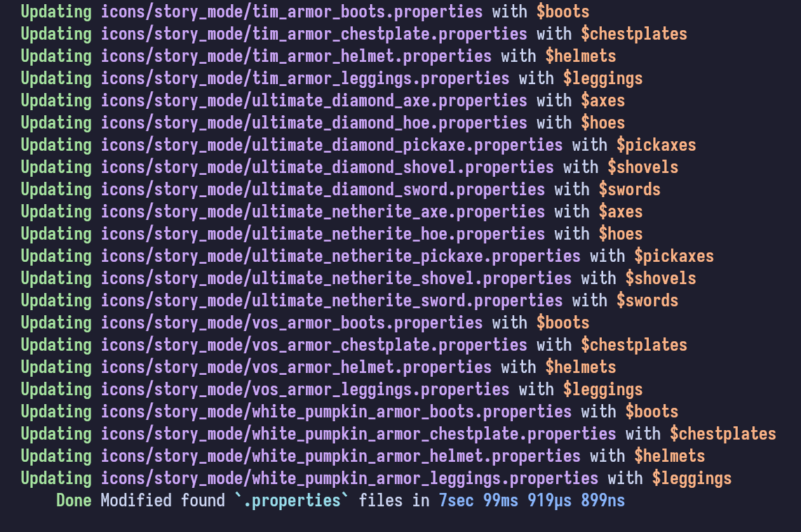

<h3 align=center>
    
</h3>
<h2 align=center>
    <code>cit-tweaker</code>
</h2>

I really like resoursepacks that have CIT renames for various items,
because it's a really vanilla-friendly way to add some variety and depth
to the already familiar items.

However, they usually only contain definitions for Minecraft's native
items (and that's absolutely expected), and I don't think there is any
in-game way to use those cool CIT renames for modded gear. This script
iterates through all of the `*.properties` files of a resourcepack,
and adds more items (see above) to the `items=` array of each texture,
based on some really simple guesses.

> [!TIP]
> The `items.nuon` file also contains some additional information.

> [!CAUTION]
> You should **read the source code of any script from the internet before running it**, this one is no exception.
